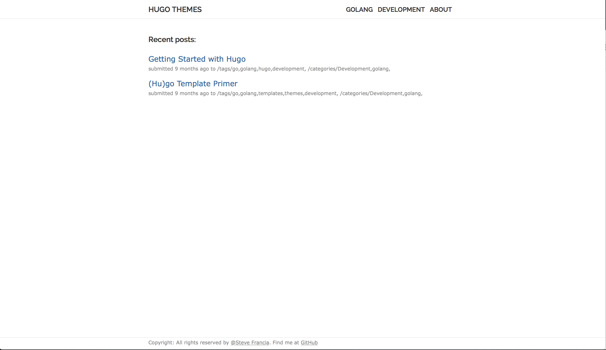
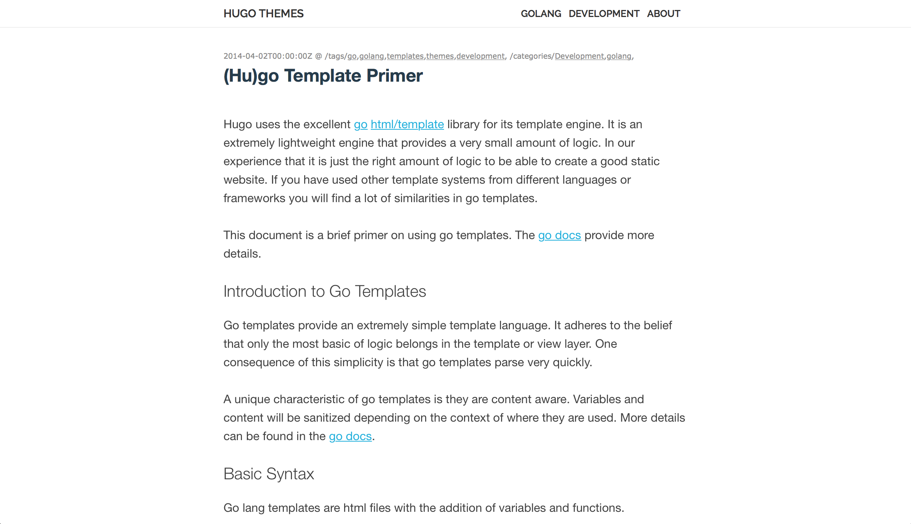

## Nofancy

Yet another [Hugo](http://hugo.spf13.com) blog theme made by love. It tries to use less design to provides full functionalities.

### Basic ideas

Are you tired of all that emerging design concepts like flat or material? Are you sick of getting distracted when pages filled up with those fancy nonsense? Here I brought up a new distraction-free theme -- nofancy.

Some ideas behind this:

1. If it is not (or almost not) needed, get rid of it.

2. The blog's content matters.

3. The SNS thing shall not appears before blog contents.

4. Clean and mobile-friendly.

5. Have ability to sort content by categories, tags, series.

### Snapshots

list view:


content view:


### Config

Note that only posts in content/post will be displayed and the author setting in `config.toml` is slightly different:

```toml
baseurl = "http://hugo.spf13.com/"
title = "Hugo Themes"
#author = "Steve Francia"
copyright = "Copyright (c) 2008 - 2014, Steve Francia; all rights reserved."

[author]
    name = "Steve Francia"
    github = "spf13"

```
